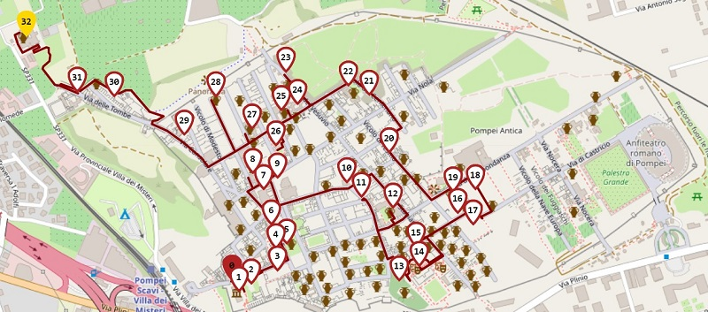

# Lo studio del problema di un'applicazione reale dell'Orienteering

Si studia il problema della generazione automatica ed efficiente di itinerari per turisti che vogliono visitare il sito archeologico di Pompei. Fare il piano di visita che include i Point Of Interest più interessanti da visitare, per la distanza o tempo a disposizione, è solitamente un problema complesso. Pertanto si creano sistemi che tendono a massimizzare il più possibile la soddisfazione del turista realizzando un piano di viaggio personalizzato.

L’obiettivo è pianificare un tour, con distanze massime variabili, che servirà al turista per la visita di un certo numero di ambienti del sito archeoligico/POI (Point Of Interest).

In generale, da un punto di vista descrittivo si possono definire i seguenti vincoli: non tutti gli ambienti possono essere visitati durante la visita, poichè i km percorsi durante la visita è limitato ad un certo Dmax; ogni ambiente può essere visitato al massimo una volta.
L’obiettivo è trovare una visita che includa il maggior valore di soddisfazione totale tenendo conto della distanza massima prefissata del viaggio.

Per dimostrare la bontà del modello, si è provato ad applicarlo a delle istanze Benchmark al modello esatto e alle euristiche confrontandone i risultati. Soltanto dopo, si è applicato il modello all'applicazione reale descritta finora.

**Gli algoritmi usati sono:**  
- Algoritmo esatto
- Algoritmo simeuristico di Panadero Juan (Greedy, Biased Randomisation)
- Algoritmo metauristico Genetic Algorithm

*È consigliato eseguire i notebook Jupyter* \
Alcune librerie particolari utilizzate sono:
- Gurobi 
- openrouteservice 

# Risultati ottenuti dall'algoritmo esatto
| Entrata/Uscita scelta                 | Valore di Soddisfazione (TOTALE) | N.POI | Ore circa di percorrenza |
|---------------------------------------|----------------------------------|-------|------------------------|
| Porta Marina - Piazza Anfiteatro      | 83                               | 25    | 4                      |
| Porta Marina - Villa dei Misteri      | 105                              | 33    | 6                      |
| Piazza Anfiteatro - Villa dei Misteri | 130                              | 41    | 8                      |

#### Percorso Porta Marina - Piazza Anfiteatro

Porta Marina (0) > Piazza Anfiteatro (24) - 1.982 Km percorribili (lda)

#### Percorso Porta Marina - Villa dei Misteri

Porta Marina (0) > Villa dei Misteri (32) - 2.98 Km percorribili (lda)

#### Percorso Piazza Anfiteatro - Villa dei Misteri

Piazza Anfitatro (0) > Villa dei Misteri (40) - 3.98 Km percorribili (lda)

Per visualizzare il nome di ogni N.POI eseguire il notebook Algoritmo_esatto_Orienteering.ipynb

# Bibliografia e Sitografia
- A simheuristic-learnheuristic algorithm for the Orienteering problem, https://informs-sim.org/wsc20papers/145.pdf
Heuristic for Orienteering Problem, https://github.com/mattianeroni/MSTOP
- A Genetic Algorithm with Grouping Selection and Searching Operators for the Orienteering Problem, https://link.springer.com/chapter/10.1007/978-3-319-15705-4_4
- GA for Orienteering Problem, https://github.com/LongShushen/using-GA-with-group-selection-to-solve-Orienteering-Problem
- Dispense degli AUTORI

***Autori*** 
Antonio Romano 
Giuseppe Riccio 
